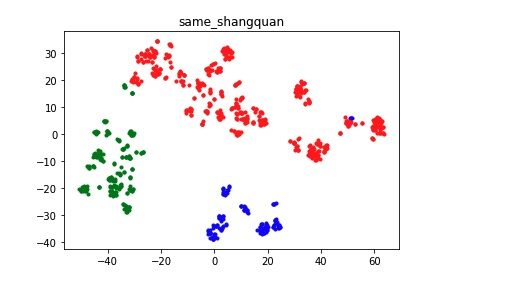
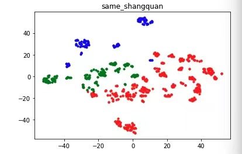

# 双塔模型实践记录

## 负采样

## 模型调参优化
- 是否需要在塔顶做归一化： 答案理论上是肯定的，但是auc在0.51左右 升不上去，先去掉L2_norm (work), 需要配合温度系数一起使用，温度系数需要具体调参
- 调大塔顶输出的emb_size 4->8->16->64,   发现emb_size增大，最后可视化的emb效果就越好
- 温度系数 0.1->0.01->0.001（work） 考虑是否通过学习的方式，让模型自适应一个温度系数，定义layer的方式，初始化一个权重作为温度系数，但是效果不佳，且不可控
- 底层embedding共享去掉，分开初始化（work auc->0.76）
- relu -> leakyRelu (work)
- 正则： L2， batch_norm, Dropout
- 固定学习率 -> 自适应学习率

## 模型特征优化
- 加入样本年龄，效果不明显
- bilstm抽取用户的访问序列特征  模型训练的难度增加，收敛较慢

## 模型结构优化
- base 双塔

- 双塔 （ResNet）

- 双塔 + SeNet

- 多兴趣SENet双塔模型 Multi-Interest-Senet-Two-Towers (MISTT)

- 腾讯并联双塔 （Parallel Towers）

### 模型AB测试上线
一、整体数据效果分析：
A组实验组，曝光数下降3～4k， 点击数基本不变， 因此点击率略有提升
B组对照组，曝光保持不变，点击数不变，点击率无明显变化

综合结论：模型上线后，对点击率有正向影响，并且商业的点击率有略微上升且点击量无明显变化（去除了部分无效的商业曝光）

# Embedding可视化效果
base双塔 + 规则负采样：

base双塔 + 全国采样 n*5, 同城采样其他房源 5个 补充曝光未点击样本 

双塔 + SeNet

双塔 + SeNet + 增加曝光未点击样本  增加到原来的1.5倍

MISTT

parallel Towers

